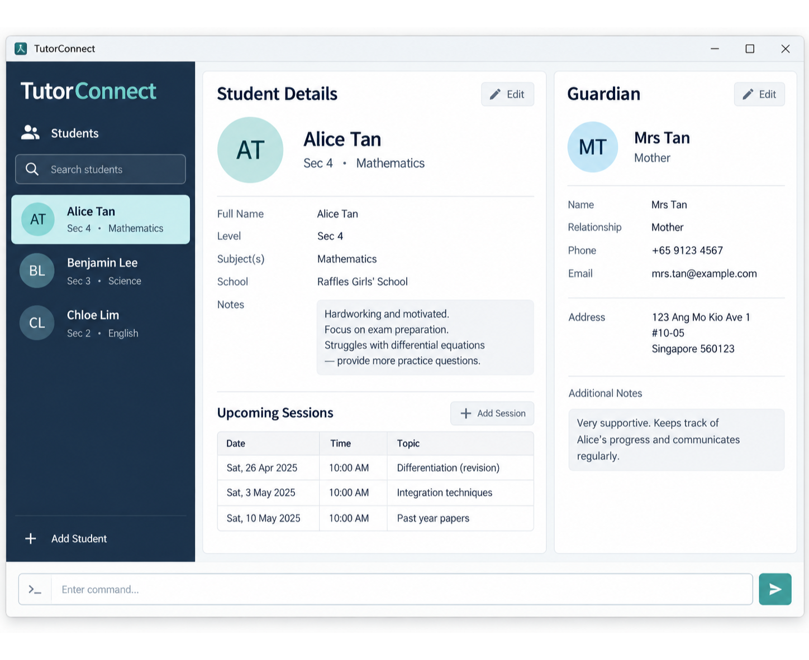

# TutorConnect

## Intended user interface

The interface keeps the command box and contact overview visible in one window, allowing tutors to enter commands
and immediately review student and guardian records. It is designed to support keyboard-first operation while keeping
status messages and validation feedback easy to see.

TutorConnect is a desktop application for independent private tutors who teach a small recurring group of secondary-school and junior-college students.

It helps tutors organize student and guardian contact details alongside essential tutoring context, so they can retrieve and update information quickly.

For more information, visit the [TutorConnect product website](https://ay2627s1-cs2103t-f14-1.github.io/tp/).
