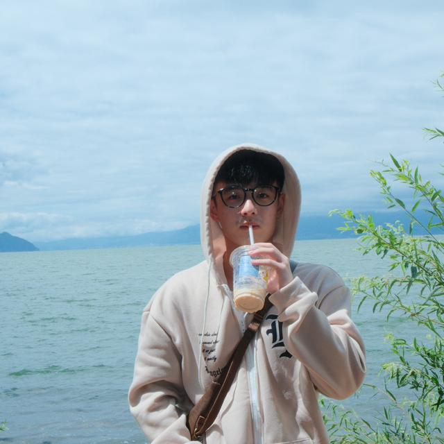
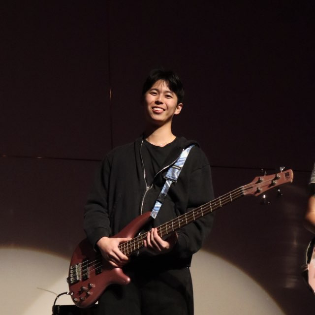
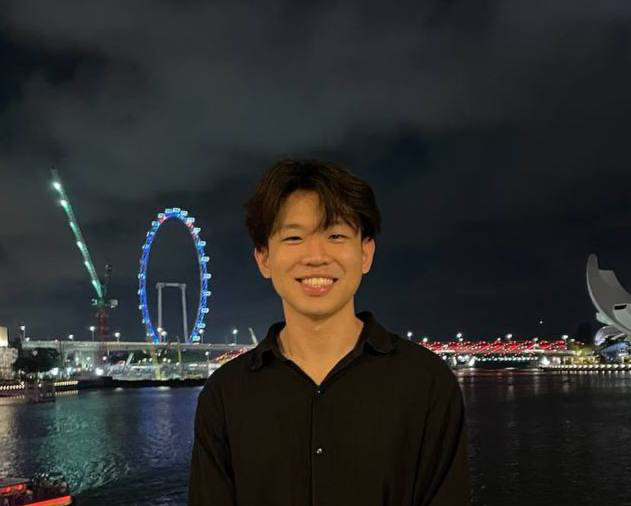
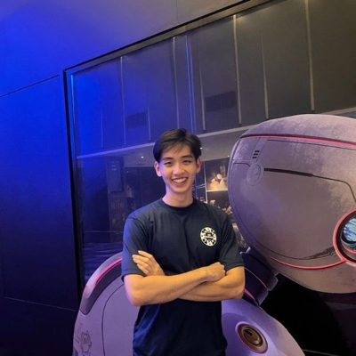

We are a team based in the [School of Computing, National University of Singapore](https://www.comp.nus.edu.sg).

You can reach us at the email `seer[at]comp.nus.edu.sg`

## Project team

### Darren Lim

[[github](https://github.com/darrny)]

* Role: Developer
* Responsibilities: Documentation and integration

### Bryan Lim

[[github](https://github.com/limjunan)]

* Role: Developer
* Responsibilities: Code quality + Testing

### Jeryl Chwa

[[github](https://github.com/JerylChwa)]

* Role: Developer
* Responsibilities: UI

### Benjamin Teng

[[github](https://github.com/bentengly)]

* Role: Developer
* Responsibilities: Logic + Storage

